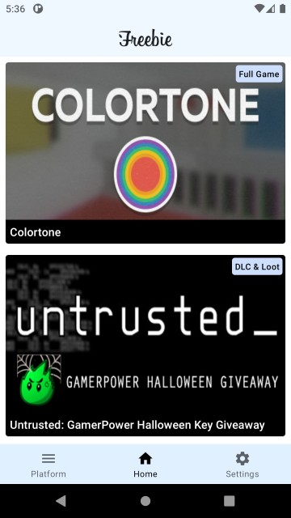
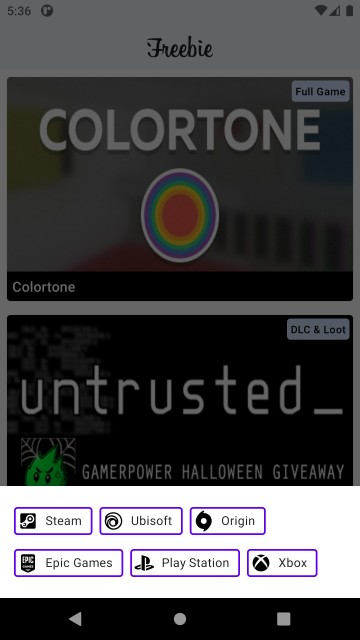
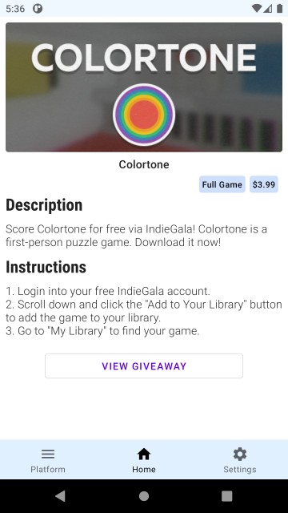

# Freebie
Access the best giveaways in gaming, from free games to beta keys to free in-game loot and more from top gaming platforms written in **Kotlin**, keeping in mind proper coding guidelines and app architecture so that it is easy to maintain and scale.

* Clean Architecture With **MVVM**

* [GamerPower](https://www.gamerpower.com/) - the source of every displayed game in the app.

* [Retrofit](https://square.github.io/retrofit/) - used for networking.

* [Glide](https://github.com/bumptech/glide) - used for image loading.

* [Material Components](https://material.io/components/) - used for creating user interface.

* [DataStore](https://developer.android.com/topic/libraries/architecture/datastore) - used for storing user theme preferences.

## Screenshots

  
